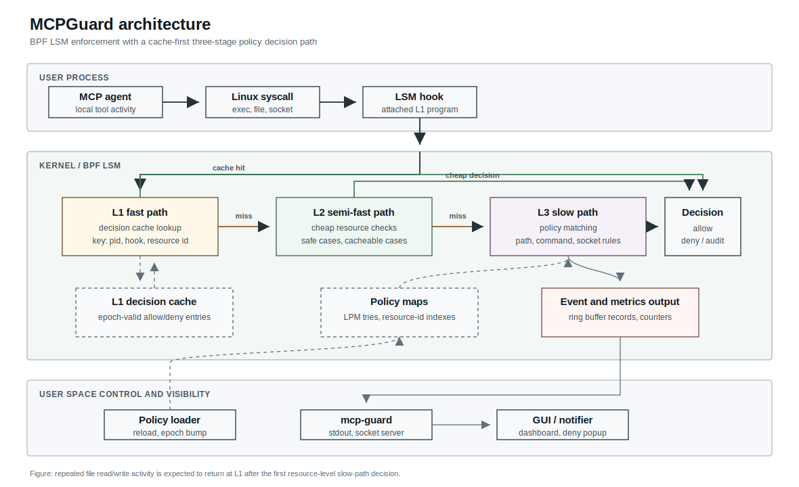
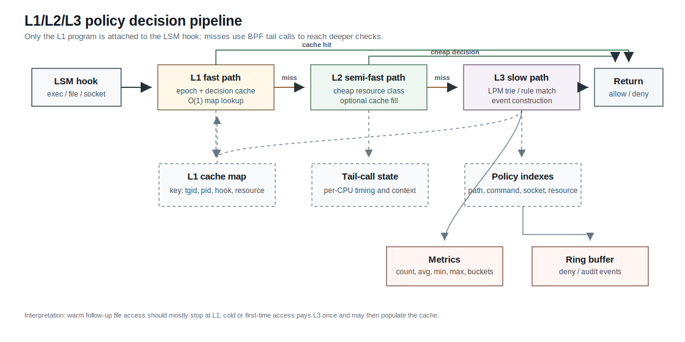
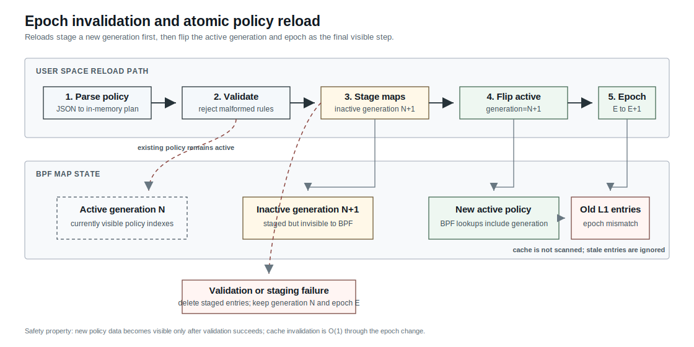
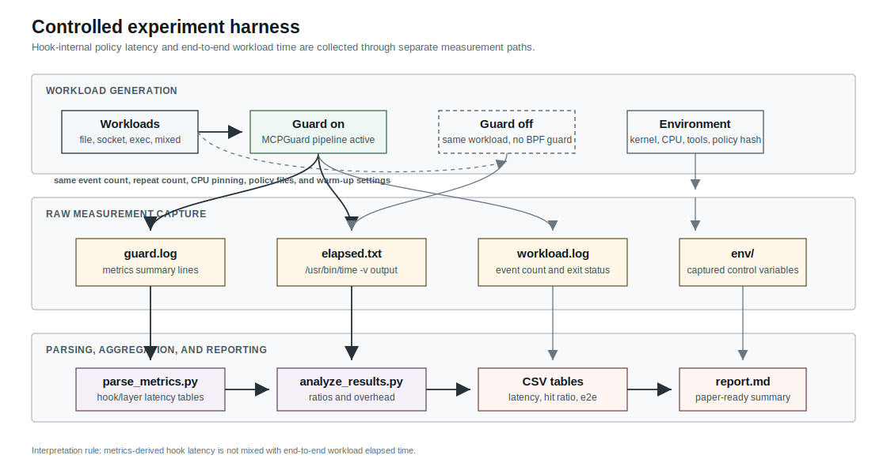

<!-- SPDX-License-Identifier: CC-BY-4.0 -->

Patent pending in Korea: KR Patent Application No. 10-2026-0094311

# PolicyTLB: MCP eBPF Guard

[Korean README](README-ko.md)

MCP eBPF Guard is a runtime security framework for local Model Context Protocol
(MCP) agents. It uses BPF LSM hooks and a TLB-hit-modeled 3-tier decision
pipeline to detect and block dangerous agent behavior with low overhead.

This is an in-progress research prototype. The implementation, GUI, policy
format, and experiment harness are intended for academic evaluation and
controlled development environments, not production deployment.

This repository implements the paper idea:

> Ultra-Low Overhead MCP Agent Behavioral Control Framework using
> TLB-Hit Modeled 3-Tier eBPF Pipeline

## Why This Exists

MCP gives LLM agents a standard way to access local tools, files, databases, and
network resources. That power also creates a sharp runtime security problem:
a prompt-injected or hijacked agent can attempt unauthorized command execution,
sensitive file access, or outbound network connections.

Traditional monitoring approaches have tradeoffs:

- `ptrace` and audit-style tracing can add heavy user/kernel context switching.
- Kernel modules can enforce strongly, but increase kernel integrity and crash
  risk.
- Naive eBPF monitors are safer, but repeated deep string checks on every event
  can still be expensive.

MCP eBPF Guard uses eBPF LSM for kernel-level enforcement without loading a
custom kernel module. The design moves expensive checks out of the hot path by
hoisting policy decisions to the resource allocation point and caching later
decisions by process, hook, and resource id.

## Paper Model

The paper maps the hardware TLB hit idea onto security policy checking.

### What TLB-Hit Modeled Means

`TLB-Hit modeled` does not mean this project directly manipulates the CPU TLB.
It means the framework copies the performance principle of a Translation
Lookaside Buffer into the security decision path.

In a CPU, a TLB hit avoids a costly page-table walk. In MCP eBPF Guard, an L1
policy-cache hit avoids a costly security-policy walk. The analogy is:

| Hardware Memory System | MCP eBPF Guard |
|---|---|
| Virtual address translation request | Runtime security decision request |
| TLB key | Process, hook, and resource cache key |
| TLB entry | Cached allow/deny/audit decision |
| TLB hit | L1 Fast Path cache hit |
| TLB miss | Fall through to L2/L3 policy evaluation |
| Page-table walk | Slow path rule matching and event emission |
| TLB shootdown/invalidation | Global epoch increment |

The important design choice is that the hot path is optimized for the common
case. Once a file, command, or socket decision is known, later events do not need
to repeat expensive path parsing or policy scans. They only need to check that
the cached decision was made under the current policy epoch.

Instead of fully validating every syscall, the framework separates checks into
three tiers:

| Tier | Purpose | Expected Cost Model |
|---|---|---:|
| L1 Fast Path | Epoch-valid cache lookup by process, hook, and resource | `0.018us` |
| L2 Semi-Fast Path | Cheap resource class checks, such as safe non-regular files | cumulative `0.023us` |
| L3 Slow Path | Deep policy evaluation, path/command/socket rule matching, event emit | cumulative `0.989us` |

The main optimization is resource-level hoisting:

1. Evaluate a resource once at allocation/open/connect/exec time.
2. Store the decision in an L1 cache with the current global epoch.
3. Reuse the decision for later read/write or repeated hook activity.
4. Invalidate all cached decisions in O(1) by incrementing a global epoch.

This mirrors TLB behavior: most events should become fast cache hits, while only
first-time or policy-changing events pay the slow-path cost.

## Current Implementation

The current implementation includes:

- BPF LSM hooks for:
  - `bprm_check_security`
  - `file_open`
  - `file_permission`
  - `socket_connect`
- L1 decision cache using a BPF LRU per-CPU hash map.
- Physical L1 -> L2 -> L3 separation using per-hook BPF tail-call
  `PROG_ARRAY` maps.
- Generation-aware LPM trie policy lookup for file path, command prefix, and
  IPv4/port network rules.
- Generation-aware resource-id hash lookup for follow-up file access.
- Runtime metrics and histogram counters by hook, layer, and action.
- Configurable L2/cache behavior flags loaded from policy config.
- MCP agent scoping through a profile file and `comm`/`pid`/`tgid` selector
  maps.
- Per-CPU tail-call state and scratch buffers to keep the BPF stack within
  verifier limits.
- Global epoch invalidation using a BPF array map.
- Policy rule map and config map.
- Ring buffer event delivery to user space.
- User-space loader using libbpf skeletons.
- Unix socket event publishing at `/tmp/mcp-guard.sock`.
- Deny tests for exec, file access, socket connect, policy reload, L1 cache
  hits, path LPM trie policy, L2 flags/cache, metrics snapshots, atomic reload,
  and MCP agent scoping.
- Timing instrumentation with `layer`, `duration_ns`, `duration_us`,
  `model_us`, and `delta_us`.

## Repository Layout

```text
bpf/
  mcp_guard.bpf.c          BPF LSM hook entrypoints and tail-call chain
  l1_fast_path.bpf.c       L1 cache lookup/store and resource id helpers
  l2_semi_fast_path.bpf.c  Cheap resource class checks
  l3_slow_path.bpf.c       Policy matching and ring buffer event emission
  maps.bpf.h               BPF maps, tail-call program arrays, scratch state
  vmlinux.h                CO-RE kernel type header

include/
  common.h                 Shared constants and enums
  cache_key.h              L1 cache key/value ABI
  policy.h                 Policy config/rule ABI
  event.h                  Ring buffer event ABI

loader/
  main.c                   Loader lifecycle, signals, stdout events
  bpf_loader.c             libbpf load/attach and tail-call map setup
  policy_loader.c          JSON policy loader and epoch bump
  ringbuf_reader.c         BPF ring buffer polling
  unix_socket_server.c     GUI-facing Unix socket publisher

policies/
  default_policy.json
  dangerous_commands.json
  dangerous_paths.json
  dangerous_network.json
  mcp_agent_profile.json

tests/
  test_execve.sh
  test_file_access.sh
  test_socket_connect.sh
  test_policy_update.sh
  test_l1_cache.sh
  test_path_lpm_trie.sh
  test_l2_flags_cache.sh
  test_metrics_snapshot.sh
  test_atomic_reload.sh
  test_agent_scope.sh

docs/
  assets/architecture.svg       Runtime architecture diagram
  assets/decision-pipeline.svg  L1/L2/L3 policy pipeline diagram
  assets/epoch-reload.svg       Epoch invalidation and reload diagram
  assets/experiment-harness.svg Controlled experiment harness diagram
```

## Architecture



## Decision Pipeline

The implementation now uses physical tail-call separation. Each BPF LSM hook
starts in an attached L1 program. On an L1 miss, it jumps through a per-hook
`BPF_MAP_TYPE_PROG_ARRAY` to the matching L2 program. If L2 cannot make a cheap
decision, it tail-calls the matching L3 slow-path program.



Tail-call program arrays:

| Hook | Program Array | Index 0 | Index 1 |
|---|---|---|---|
| `bprm_check_security` | `exec_pipeline` | exec L2 | exec L3 |
| `file_open` | `file_open_pipeline` | file-open L2 | file-open L3 |
| `file_permission` | `file_permission_pipeline` | file-permission L2 | file-permission L3 |
| `socket_connect` | `socket_connect_pipeline` | socket L2 | socket L3 |

Only the L1 programs are attached to LSM hooks. The loader disables auto-attach
for internal L2/L3 programs, loads them with the skeleton, and writes their
program fds into the relevant `PROG_ARRAY` entries. If an expected tail call
cannot run, the hook returns `-EACCES` to fail closed.

Because BPF tail calls do not preserve stack state in a normal C-call style, the
pipeline stores cross-layer timing metadata in a per-CPU `tail_state` map.
Large temporary buffers such as path and rule-name strings live in a per-CPU
`scratch` map so the BPF verifier stack limit stays satisfied.

### L1 Fast Path

L1 uses `struct mcp_cache_key`:

- `tgid`
- `pid`
- `hook_id`
- `resource_id`

The cached value stores:

- decision epoch
- action: allow, deny, audit
- flags
- rule id
- reason

If the cache entry exists and its epoch equals the global epoch, the hook returns
immediately based on the cached action.

### L2 Semi-Fast Path

L2 avoids expensive string/path logic for obviously safe resources. For example,
non-regular files and selected directory read cases can be allowed without
policy string matching.

The loader can tune selected L2/cache behaviors through `policy_config.flags`.
Current flags include directory-read skipping, file follow-up cache population,
and fail-closed tail-call behavior.

### L3 Slow Path

L3 performs deeper checks:

- generation-aware command-prefix trie checks for exec
- generation-aware path-prefix trie matching for file-open policy
- generation-aware resource-id hash matching for follow-up file access
- generation-aware IPv4/port trie matching for socket connect
- ring buffer event emission for deny/audit decisions
- cache population for follow-up events

For file policies, the implementation uses both path strings and an inode-based
`resource_id`. This makes repeated read/write enforcement less dependent on path
string availability in every hook.

## MCP Agent Scoping

The loader reads `policies/mcp_agent_profile.json` and writes the active profile
into `policy_config`. By default policies are system-wide. When `mode` is
`scoped`, BPF checks the current process against dedicated scope maps before
running the 3-tier policy pipeline.

Supported profile fields:

```json
{
  "profile": "python-agent",
  "profile_id": 42,
  "agent_id": 7,
  "mode": "scoped",
  "comms": ["python3"],
  "pids": [1234],
  "tgids": [1234]
}
```

Scope selectors:

- `comm` or `comms`: match Linux task command names such as `python3`.
- `pid` or `pids`: match a specific thread id.
- `tgid` or `tgids`: match a process/thread-group id.

In scoped mode, non-matching local processes bypass MCP Guard enforcement and
continue normally. Matching processes use the active policy and emitted events
include `profile_id` and `agent_id` so the GUI can attribute decisions to the
right MCP profile.

## Epoch Invalidation



Policy reload does not scan and delete every cache entry. Instead:

1. User space parses and validates policy files into memory.
2. User space writes policy maps only after validation succeeds.
3. User space increments `global_epoch` last.
4. L1 cache entries with an old epoch become invalid automatically.

This makes global invalidation O(1), which is the core lock-free epoch idea from
the paper.

Reload uses a generation-aware policy index layout. The loader parses and
validates the new policy first, writes path, command, network, and resource
indexes under the next inactive generation, and flips `policy_config` plus
`global_epoch` last. BPF lookups include `active_generation` in their keys, so
partially written future-generation entries are invisible to the running policy.
After a successful flip, the loader removes the previous generation's indexed
entries. If a reload fails before the epoch bump, the loader deletes staged
entries, restores snapshotted maps where needed, and emits a `reload_result`
JSON message.

## Metrics

The BPF side records per-CPU metrics by hook, layer, and action. Each metric
entry tracks:

- decision count
- total latency
- minimum latency
- maximum latency
- 8 coarse latency histogram buckets

The loader prints a metrics summary on shutdown. Ring buffer events remain the
source for detailed deny/audit records, while the metrics map gives aggregate
visibility even when individual allow events are not emitted.

Periodic metrics snapshots can also be enabled:

```bash
sudo ./mcp-guard policies --metrics-interval 1s
```

When enabled, the loader prints `metrics snapshot` output and publishes
newline-delimited JSON messages with `"type":"metrics_snapshot"` to
`/tmp/mcp-guard.sock`.

## Policy Format

Default policy:

```json
{
  "default_action": "allow",
  "enforce": true,
  "audit_allowed": false
}
```

Command policy:

```json
{
  "rules": [
    {
      "name": "curl",
      "value": "/usr/bin/curl",
      "action": "deny"
    }
  ]
}
```

Path policy:

```json
{
  "rules": [
    {
      "name": "shadow-file",
      "value": "/etc/shadow",
      "action": "deny"
    }
  ]
}
```

Network policy:

```json
{
  "rules": [
    {
      "name": "reverse-shell-port-4444",
      "value": "0.0.0.0/0",
      "port": 4444,
      "action": "deny"
    }
  ]
}
```

## Requirements

Runtime requirements:

- Linux with eBPF and BPF LSM enabled
- `bpf` present in the active LSM chain
- `clang`
- `bpftool`
- `libbpf`
- root privileges to load BPF LSM programs

Check BPF LSM:

```bash
cat /sys/kernel/security/lsm
```

Expected output should include `bpf`, for example:

```text
lockdown,capability,landlock,yama,apparmor,bpf,ima,evm
```

If `CONFIG_BPF_LSM=y` exists but `bpf` is missing from the active LSM chain, add
it to the kernel boot parameter, update GRUB, and reboot:

```text
lsm=landlock,lockdown,yama,integrity,apparmor,bpf
```

## Build

Configure the local tool paths and libbpf linker flags:

```bash
./configure
```

Then build:

```bash
make
```

The build:

1. Reads `config.mk` when it exists.
2. Uses `bpf/vmlinux.h` for CO-RE type information.
3. Compiles `bpf/mcp_guard.bpf.c` for the BPF target.
4. Generates `build/mcp_guard.skel.h` with `bpftool`.
5. Links the `mcp-guard` user-space loader.

You can still run `make` directly without `./configure`; the Makefile keeps
the previous defaults as a fallback. To regenerate the `configure` script after
editing `configure.ac`, run:

```bash
autoconf
```

Clean build outputs:

```bash
make clean
```

Remove local `./configure` outputs as well:

```bash
make distclean
```

## Run

Start the guard:

```bash
sudo ./mcp-guard policies
```

On a desktop session, this also auto-launches the PySide6 GUI and connects it to
`/tmp/mcp-guard.sock`. The main window opens by default. Closing the window hides
it and keeps the deny-popup listener alive. Use `--no-gui` for headless runs,
tests, or manual GUI startup:

```bash
sudo ./mcp-guard policies --no-gui
```

When the GUI is started manually, closing the main window uses the same behavior:
the window hides and the notification listener stays alive by default. Use the
tray menu's `Quit GUI` action, or run `python3 gui/run_gui.py --quit-on-close`,
if you want the close button to terminate the GUI process.

Expected startup:

```text
loaded 7 policy rules, generation=1 epoch=1
policy flags: skip_dir_read=1 cache_file_followups=1 deny_tailcall_fail=1 skip_l2_safe=0
event socket listening at /tmp/mcp-guard.sock
mcp-guard running; send SIGHUP to reload policy, Ctrl-C to stop
```

Reload policies:

```bash
sudo kill -HUP $(pidof mcp-guard)
```

Stop:

```bash
sudo kill -INT $(pidof mcp-guard)
```

Read GUI-facing events:

```bash
nc -U /tmp/mcp-guard.sock
```

## Tests

Run all tests:

```bash
sudo make test
```

Run individually:

```bash
sudo ./tests/test_execve.sh
sudo ./tests/test_file_access.sh
sudo ./tests/test_socket_connect.sh
sudo ./tests/test_policy_update.sh
sudo ./tests/test_l1_cache.sh
sudo ./tests/test_path_lpm_trie.sh
sudo ./tests/test_l2_flags_cache.sh
sudo ./tests/test_metrics_snapshot.sh
sudo ./tests/test_atomic_reload.sh
sudo ./tests/test_agent_scope.sh
```

The tests verify:

- dangerous command execution denial
- protected file access denial
- suspicious IPv4 socket connect denial
- policy reload and epoch invalidation
- L1 cache hits after repeated access from the same process
- LPM trie path-prefix deny and longest-prefix allow behavior
- L2 safe-resource hits and policy flag validation
- periodic metrics snapshots and GUI-facing metrics JSON
- failed reload rollback with unchanged active policy and epoch
- scoped policy enforcement for selected MCP agent processes only

Sample output:

```text
[deny] pid=15263 uid=0 hook=exec layer=L3 duration_ns=3887 duration_us=3.887 model_us=0.989 delta_us=2.898 rule=1 error=13 path=/usr/bin/true rule=test-true
```

## Controlled Experiments

The repository includes a controlled experiment harness under `experiments/` for
paper-oriented evaluation. It separates eBPF hook-internal policy latency from
end-to-end workload overhead.



Default experiment settings:

```text
EXPERIMENT_REPEATS=30
EXPERIMENT_EVENTS_PER_RUN=100000
EXPERIMENT_WARMUP_RUNS=3
EXPERIMENT_CPU_CORE=2
```

Run the full suite:

```bash
sudo make experiment-preflight
sudo make experiment-all
```

Run individual experiments:

```bash
sudo make experiment-latency
sudo make experiment-hit-ratio
sudo make experiment-lpm
sudo make experiment-reload
sudo make experiment-e2e
```

Clean stale experiment state before rerunning after interruption:

```bash
sudo experiments/scripts/clean_experiment_state.sh
```

Each experiment writes raw logs, parsed metrics, CSV tables, environment
metadata, and a report under `experiments/results/`. Result directories are
ignored by git.

### Reference Experiment Environment

The validated reference run used the following captured environment. Full raw
environment files are stored in each result directory under `env/`.

| Item | Captured value |
|---|---|
| Host | `reference-laptop` |
| OS / kernel | Ubuntu `24.04.4 LTS (Noble Numbat)`, Linux `6.17.0-14-generic` |
| CPU | Intel Core Ultra 7 155H, 22 online logical CPUs |
| Memory | `15Gi` total RAM |
| Clang | Ubuntu clang `18.1.3` |
| GCC | Ubuntu GCC `13.3.0` |
| bpftool / libbpf | bpftool `v7.7.0`, libbpf `v1.7` |
| Active LSM chain | `lockdown,capability,landlock,yama,apparmor,bpf,ima,evm` |
| BPF JIT | enabled, `/proc/sys/net/core/bpf_jit_enable=1` |
| CPU governor | `performance` on all online CPUs |
| Pinned CPU core | `EXPERIMENT_CPU_CORE=2` |
| Run volume | `30` repeats, `100000` events per measured run |
| Warm-up | `3` warm-up runs for latency benchmark |
| Load average snapshot | `1.69 1.92 1.81` |
| Thermal snapshot | exposed zones ranged from about `20C` to `82C`; this is recorded as a possible throttling factor, not treated as a controlled constant |

### Variable Control

The experiment harness fixes or records the main variables needed for
paper-quality interpretation:

- same git commit, build flags, policy files, and workload event counts
- same root privilege, temp directory base, loopback target, and measurement
  scripts
- CPU core pinning through `taskset` when available
- CPU governor, kernel version, compiler versions, BPF JIT status, load
  average, thermal hints, and policy hashes captured under each result's `env/`
  directory
- warm-up runs separated from measured runs
- hook-internal latency measured separately from end-to-end workload time

General-purpose Linux cannot perfectly eliminate scheduler activity,
interrupts, cache state, thermal behavior, or background daemons. The harness
therefore fixes controllable variables and records the remaining environment so
results can be interpreted with that context. See
`experiments/VARIABLE_CONTROL.md` for the full variable-control protocol.

### Experiment Variables

| Category | Variables | Handling in experiments |
|---|---|---|
| Independent variables | Processing layer: L1 Fast Path, L2 Semi-Fast Path, L3 Slow Path | Compared by the `layer` field in hook metrics |
| Independent variables | Hook type: `exec`, `file_open`, `file_read`, `file_write`, `socket_connect` | Measured across latency, hit-ratio, LPM, and end-to-end workloads |
| Independent variables | Policy type: exact command rule, exact file rule, LPM Trie path-prefix rule, socket port rule, reload/epoch policy | Repeated with benchmark-specific policy directories under the same conditions |
| Independent variables | Execution mode: guard off, guard on, cold/warm cache behavior | End-to-end benchmark compares guard off/on; hit-ratio benchmark measures repeated warm I/O |
| Dependent variables | Hook latency: `duration_ns`, `duration_us`, average, min, max, approximate p50/p95/p99 | Parsed from `guard.log` metrics summaries into `metrics.csv` and `latency_by_hook_layer.csv` |
| Dependent variables | Path ratio: L1/L2/L3 count and ratio | Calculated per hook in `hit_ratio_by_workload.csv` |
| Dependent variables | Workload result: total event count, elapsed time, throughput, allow/deny count | Aggregated from `elapsed.txt`, workload logs, and generated CSV tables |
| Dependent variables | Reliability result: reload success, rollback success, exit status | Calculated from repeated reload benchmark outcomes in `reload_consistency.csv` |
| Controlled variables | Hardware, OS, kernel, compiler, libbpf/bpftool, BPF JIT status | Captured by `collect_env.sh` under each result directory's `env/` folder |
| Controlled variables | Git commit, build flags, policy files, policy hashes | Run from the same repository state and recorded in `env/git.txt` and `env/policy_hash.txt` |
| Controlled variables | Workload event count, repeat count, warm-up count, measurement scripts | Fixed through `experiment.env` defaults and shared scripts |
| Controlled variables | CPU governor, CPU core pinning, root privilege, temp directory base, loopback network target | Uses `performance` governor and `taskset` pinning where available, and records the environment |
| Recorded uncontrolled variables | Scheduler decisions, interrupts, cache/TLB state, thermal throttling, background services, filesystem cache | Not fully removable on desktop Linux; mitigated through repeated measurements plus `env/loadavg.txt` and `env/thermal.txt` records |

Validated reference results from a controlled local run:

| Claim | Result |
|---|---:|
| `file_open` L1 vs L3 average latency | `80.10ns` vs `1860.28ns` (`23.22x`) |
| `file_read` L1 vs L3 average latency | `70.80ns` vs `1680.20ns` (`23.73x`) |
| `file_write` L1 vs L3 average latency | `75.99ns` vs `1758.25ns` (`23.14x`) |
| `file_open` L1 hit ratio | `99.9056%` |
| `file_read` L1 hit ratio | `99.9976%` |
| `file_write` L1 hit ratio | `99.9996%` |
| Atomic reload / rollback | `30/30` successful runs |
| End-to-end guard-on overhead | `6.234%` |

Interpretation limits:

| Result type | Interpretation limit |
|---|---|
| L1/L3 average latency | Measures hook-internal BPF policy decision time, not full syscall latency or full application response time |
| Hit ratio | Represents the configured repeated warm I/O workload; other access patterns may produce different L1/L2/L3 ratios |
| LPM Trie depth result | Includes path extraction and policy lookup effects for the benchmark paths; filesystem and cache state can affect elapsed workload time |
| Reload / rollback success | Validates the tested atomic reload failure and recovery scenario, not every possible malformed policy or runtime failure |
| End-to-end overhead | Applies to the included file-I/O workload on the captured machine and should not be generalized without rerunning on the target environment |
| p50/p95/p99 latency | Reported percentiles are histogram-bucket approximations unless a separate debug raw-trace mode is used |
| Thermal readings | The highest exposed thermal zone reached about `82C`; this does not by itself prove throttling, but it should be reported as an uncontrolled environmental factor |

Use these numbers as a reference for the same machine and configuration, not as
portable constants. The environment collector records kernel, compiler, BPF JIT,
CPU governor, load average, git commit, and policy hashes so runs can be
reported with their measurement context.

## Timing Interpretation

The implementation emits timing data for deny/audit events.

Fields:

- `layer`: layer where the decision was made
- `duration_ns`: hook entry to event emission
- `duration_us`: `duration_ns / 1000`
- `model_us`: paper-derived cumulative cost baseline
- `delta_us`: measured value minus model baseline

Current baselines:

| Layer | Baseline |
|---|---:|
| L1 | `0.018us` |
| L2 | `0.023us` |
| L3 | `0.989us` |

The measured runtime value includes more than pure policy lookup. It includes helper
calls, map lookups, event preparation, and ring buffer submission. L3 events are
therefore expected to be higher than the idealized paper model. To evaluate the
paper's main claim, measure repeated access after the first L3 miss and compare
L1 hit behavior against the L3 slow path.

## Current Limitations

- Event timing is emitted for deny/audit events, not every allow event.
- GUI files are still maturing toward a complete operator dashboard.

## License

This repository uses multiple open-source licenses by component.

| Component | License |
|---|---|
| Core enforcement engine: `bpf/`, `loader/`, core `include/`, `tests/`, `experiments/`, `scripts/`, `policies/` | GPL-2.0-or-later |
| Client library / SDK: `libmcpguard/`, `sdk/`, `clients/`, `include/client/` | LGPL-2.1-or-later |
| GUI / dashboard: `gui/`, `web-dashboard/`, `operator-console/` | AGPL-3.0-or-later |
| Documentation, figures, papers, and presentation materials: `docs/`, `paper/`, `figures/`, `presentations/` | CC-BY-4.0 |

The core enforcement engine and the GUI are designed as separate programs. They
communicate through a Unix domain socket using newline-delimited JSON events.
The GUI should not directly link against or copy GPL core implementation code.

The BPF object declaration `char LICENSE[] SEC("license") = "GPL"` is used as
kernel-facing BPF verifier/helper compatibility metadata and does not override
the SPDX license headers of repository files.

Code blocks in this README follow the license of the component they describe.

See `LICENSE`, `LICENSES/`, and `docs/LICENSE_POLICY.md` for details.

## Repository History Notice

This repository is a cleaned public research release. The original development
repository was recreated because an earlier commit history contained sensitive
local configuration and environment-specific files. The current repository
preserves the implementation, documentation, tests, and experiment harness in a
sanitized form suitable for public review.

## Safety Note

This is an experimental, in-progress research project. It attaches BPF LSM
programs and can deny real process, file, and socket operations. Test it in a
development environment before using it on a primary workstation, and review the
policy files carefully before enabling enforcement.
